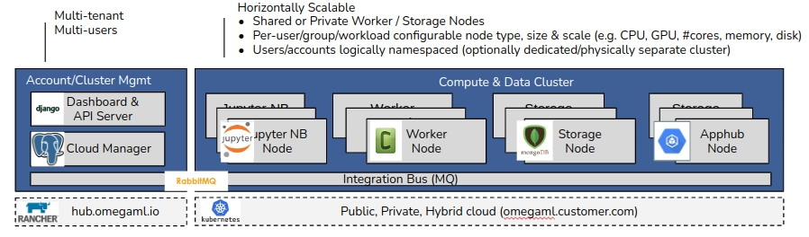

Deployment
==========

The platform is deployed in two logically or physically separated areas,

* *Account/Cluster Management* is concerned with managing tenants and
  users

* *Compute/Data Cluster* serves the workloads used by data scientists,
  data engineers and end-users.

The two areas are interconnected by RabbitMQ as a messaging bus.

Docker Images
-------------

The platform is delivered as two docker images, with respective dependencies:

1. *omegaml/omegamlee* - the commercial edition
2. *omegaml/apphub* - the apphub component

Dependencies
------------

The platform is dependent on several services to exist in its environment,
which can be provided independently or as docker images.

+-------------+------------------+---------------------------------------------------------------------------+-----------------+
| **service** | **docker image** | **purpose**                                                               | **designation** |
+-------------+------------------+---------------------------------------------------------------------------+-----------------+
| rabbitmq    | rabbitmq         | Platform messaging                                                        | required        |
+-------------+------------------+---------------------------------------------------------------------------+-----------------+
| mongodb     | mongo            | Analytics storage                                                         | required        |
+-------------+------------------+---------------------------------------------------------------------------+-----------------+
| postgres    | postgres         | Account and cluster management database                                   | required        |
+-------------+------------------+---------------------------------------------------------------------------+-----------------+
| nginx       | nginx            | Front end to all services provided by the platform (including http & tcp) | optional        |
+-------------+------------------+---------------------------------------------------------------------------+-----------------+
| redis       | redis            | Apphub session storage (can be configured for redis or an  postgres)      | optional        |
+-------------+------------------+---------------------------------------------------------------------------+-----------------+

Instead of postgres, mssql is supported optionally.

.. include:: docker.rst

.. include:: kubernetes.rst
