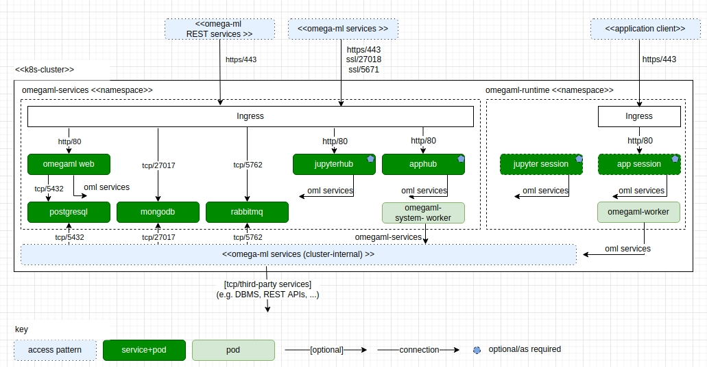

Deployment using kubernetes
---------------------------

Kubernetes is the basis for a scalable deployment. In line with the
deployment concept introduced above, an omega-ml deployment in a
kubernetes cluster provides two name spaces:

* *omegaml-services* - provides account and cluster management services,
  including omegaweb, apphub and all the storage services shared by users

* *omegaml-runtime* - provides the omega-ml runtime components and instantiates
  specific instances of workers for apphub, jupyter and omega-ml itself

